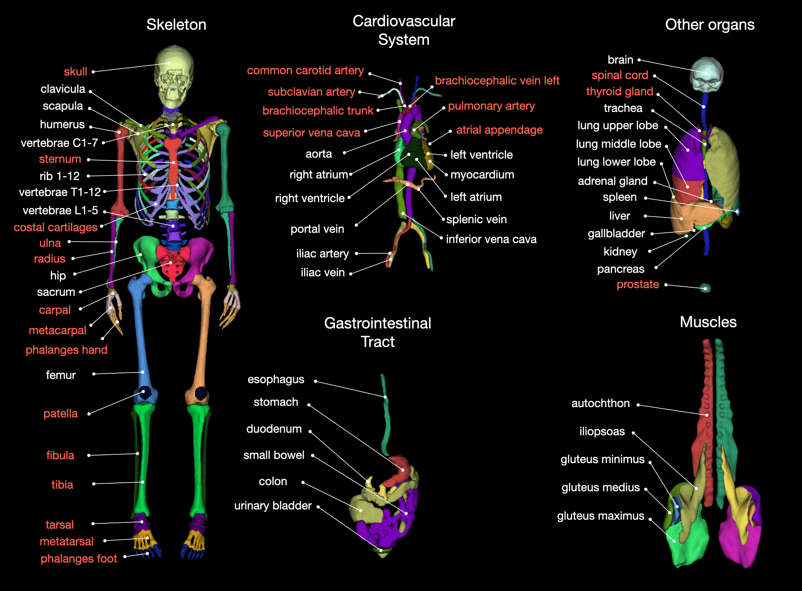
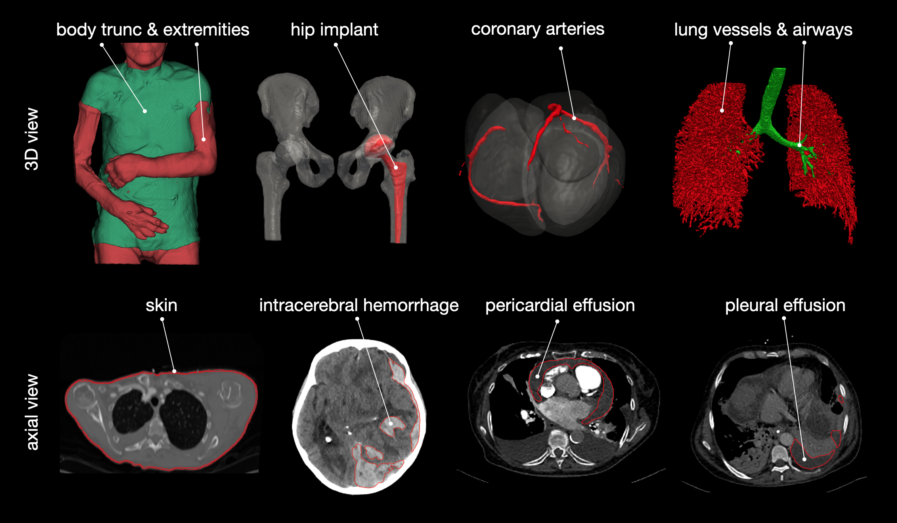

# TotalSegmentator

Tool for segmentation of 104 classes in CT images. It was trained on a wide range of different CT images (different scanners, institutions, protocols,...) and therefore should work well on most images. The training dataset with 1204 subjects can be downloaded from [Zenodo](https://doi.org/10.5281/zenodo.6802613). You can also try the tool online at [totalsegmentator.com](https://totalsegmentator.com/).



Created by the department of [Research and Analysis at University Hospital Basel](https://www.unispital-basel.ch/en/radiologie-nuklearmedizin/forschung).  
If you use it please cite our paper: [https://arxiv.org/abs/2208.05868](https://arxiv.org/abs/2208.05868). Please also cite [nnUNet](https://github.com/MIC-DKFZ/nnUNet) since TotalSegmentator is heavily based on it.


### Installation

TotalSegmentator works on Ubuntu, Mac and Windows and on CPU and GPU (on CPU it is slow).

Install dependencies:  
* Python >= 3.7
* [Pytorch](http://pytorch.org/)
* if you use the option `--preview` you have to install xvfb (`apt-get install xvfb`)
* You should not have any nnU-Net installation in your python environment since TotalSegmentator will install its own custom installation.

* optionally: for faster resampling you can use `cucim` (`pip install cupy-cuda11x cucim`)

Install Totalsegmentator
```
pip install TotalSegmentator
```


### Usage
```
TotalSegmentator -i ct.nii.gz -o segmentations
```
> Note: Only nifti files are supported. To convert dicom files to nifti we recommend [dcm2niix](https://github.com/rordenlab/dcm2niix).  

> Note: If a CUDA compatible GPU is available TotalSegmentator will automatically use it. Otherwise it will use the CPU, which is a lot slower and should only be used with the `--fast` option.  

> Note: You can also try it online: [www.totalsegmentator.com](https://totalsegmentator.com/) (supports dicom files)

> Note: This is not a medical device and not intended for clinical usage.


### Advanced settings
* `--fast`: For faster runtime and less memory requirements use this option. It will run a lower resolution model (3mm instead of 1.5mm). 
* `--preview`: This will generate a 3D rendering of all classes, giving you a quick overview if the segmentation worked and where it failed (see `preview.png` in output directory).
* `--ml`: This will save one nifti file containing all labels instead of one file for each class. Saves runtime during saving of nifti files.
* `--roi_subset`: Takes a space separated list of class names (e.g. `spleen colon brain`) and only saves those classes. Saves runtime during saving of nifti files.
* `--statistics`: This will generate a file `statistics.json` with volume (in mm³) and mean intensity of each class.
* `--radiomics`: This will generate a file `statistics_radiomics.json` with radiomics features of each class. You have to install pyradiomics to use this (`pip install pyradiomics`).
 

### Subtasks



We added some more models to TotalSegmentator beyond the default one. This allows segmentation of even 
more classes in more detailed subparts of the image. First you have to run TotalSegmentator with the 
normal settings to get the normal masks. These masks are required to crop the image to a subregion on 
which the detailed model will run.
```
TotalSegmentator -i ct.nii.gz -o segmentations --fast
TotalSegmentator -i ct.nii.gz -o segmentations -ta lung_vessels
```
Overview of available subtasks and the classes which they contain.

Openly available:  
* **lung_vessels**: lung_vessels (cite [paper](https://www.sciencedirect.com/science/article/pii/S0720048X22001097)), lung_trachea_bronchia
* **cerebral_bleed**: intracerebral_hemorrhage
* **hip_implant**: hip_implant
* **coronary_arteries**: coronary_arteries
* **body**: body, body_trunc, body_extremities, skin
* **pleural_pericard_effusion**: pleural_effusion (cite [paper](http://dx.doi.org/10.1097/RLI.0000000000000869)), pericardial_effusion (cite [paper](http://dx.doi.org/10.3390/diagnostics12051045))

Available after purchase of a license (free licenses possible for academic projects). Contact jakob.wasserthal@usb.ch if you are interested: 
* **bones_extremities**: femur, patella, tibia, fibula, tarsal, metatarsal, phalanges_feet, humerus, ulna, radius, carpal, metacarpal, phalanges_hand, sternum, skull, spinal_cord
* **tissue_types**: subcutaneous_fat, skeletal_muscle, torso_fat
* **heartchambers_highres**: myocardium, atrium_left, ventricle_left, atrium_right, ventricle_right, aorta, pulmonary_artery (more precise heart chamber segmentation, trained on sub-millimeter resolution)
* **head**:  mandible, teeth, brainstem, subarachnoid_cavity, venous_sinuses, septum_pellucidum, cerebellum, caudate_nucleus, lentiform_nucleus, insular_cortex, internal_capsule, ventricle, central_sulcus, frontal_lobe, parietal_lobe, occipital_lobe, temporal_lobe, thalamus, tyroid (trained on sub-millimeter resolution)
* **aortic_branches**:  brachiocephalic_trunc, subclavian_artery_right, subclavian_artery_left, common_carotid_artery_right, common_carotid_artery_left, brachiocephalic_vein_left, brachiocephalic_vein_right, atrial_appendage_left, superior_vena_cava, pulmunary_vein, tyroid


### Run via docker
We also provide a docker container which can be used the following way
```
docker run --gpus 'device=0' --ipc=host -v /absolute/path/to/my/data/directory:/tmp wasserth/totalsegmentator_container:master TotalSegmentator -i /tmp/ct.nii.gz -o /tmp/segmentations
```


### Resource Requirements
Totalsegmentator has the following runtime and memory requirements (using a Nvidia RTX 3090 GPU):  
(1.5mm is the normal model and 3mm is the `--fast` model)


If you want to reduce memory consumption you can use the following options:
* `--body_seg`: This will crop the image to the body region before processing it
* `--force_split`: This will split the image into 3 parts and process them one after another
* `--nr_thr_saving 1`: Saving big images with several threads will take a lot of memory


### Train / validation / test split
The exact split of the dataset can be found in the file `meta.csv` inside of the [dataset](https://doi.org/10.5281/zenodo.6802613). This was used for the validation in our paper.  
The exact numbers of the results for the high resolution model (1.5mm) can be found [here](resources/results_all_classes.json). The paper shows these numbers in the supplementary materials figure 11. 
To aggregate results across subjects and classes the following approach was taken: For each class in each subject calculate the (Dice) score, then take the average of all scores (micro averaging). If a class is not present on an image (e.g. the brain is not present on images of the legs) then exclude this value from the calculation.

> Note: The model was trained on unblurred images. The published training dataset, however, has blurred faces for data privacy reasons. Therefore, models trained on the public dataset cannot be directly compared to our pretrained model. In the future we plan to provide a version of our model which was trained on the public blurred dataset so people can compare to this as a baseline. 


### Retrain model on your own
You have to download the data and then follow the instructions of [nnU-Net](https://github.com/MIC-DKFZ/nnUNet) how to train a nnU-Net. We trained a `3d_fullres` model and the only adaptation to the default training is setting the number of epochs to 4000 and deactivating mirror data augmentation. The adapted trainer can be found [here](https://github.com/wasserth/nnUNet_cust/blob/working_2022_03_18/nnunet/training/network_training/custom_trainers/nnUNetTrainerV2_ep4000_nomirror.py).
For combining the single masks into one multilabel file you can use the function `combine_masks_to_multilabel_file` in [totalsegmentator.libs](https://github.com/wasserth/TotalSegmentator/blob/master/totalsegmentator/libs.py).


### Other commands
If you want to combine some subclasses (e.g. lung lobes) into one binary mask (e.g. entire lung) you can use the following command:
```
totalseg_combine_masks -i totalsegmentator_output_dir -o combined_mask.nii.gz -m lung
```

Normally weights are automatically downloaded when running TotalSegmentator. If you want to manually download the weights (download links see [here](https://github.com/wasserth/TotalSegmentator/blob/master/totalsegmentator/libs.py#L75)) and copy them into the right directory so TotalSegmentator can find them use this:
```
totalseg_import_weights -i my_downloaded_weights.zip
```

### Python API
You can run totalsegmentator via python:
```python
from totalsegmentator.python_api import totalsegmentator

totalsegmentator(input_path, output_path)
```


### Install latest master branch (contains latest bug fixes)
```
pip install git+https://github.com/wasserth/TotalSegmentator.git
```


### Typical problems
When you get the following error message
```
ITK ERROR: ITK only supports orthonormal direction cosines. No orthonormal definition found!
```
you should do
```
pip install SimpleITK==2.0.2
```


### Reference 
For more details see this paper [https://arxiv.org/abs/2208.05868](https://arxiv.org/abs/2208.05868).
If you use this tool please cite it as follows
```
Wasserthal J., Meyer M., Breit H., Cyriac J., Yang S., Segeroth M. TotalSegmentator: robust segmentation of 104 anatomical structures in CT images, 2022. URL: https://arxiv.org/abs/2208.05868.  arXiv: 2208.05868
```
Please also cite [nnUNet](https://github.com/MIC-DKFZ/nnUNet) since TotalSegmentator is heavily based on it.  
Moreover, we would really appreciate if you let us know what you are using this tool for. You can also tell us what classes we should add in future releases. You can do so [here](https://github.com/wasserth/TotalSegmentator/issues/1).


### Class details

The following table shows a list of all classes.

TA2 is a standardised way to name anatomy. Mostly the TotalSegmentator names follow this standard. 
For some classes they differ which you can see in the table below.

|TotalSegmentator name|TA2 name|
|:-----|:-----|
spleen ||
kidney_right ||
kidney_left ||
gallbladder ||
liver ||
stomach ||
aorta ||
inferior_vena_cava ||
portal_vein_and_splenic_vein | hepatic portal vein |
pancreas ||
adrenal_gland_right | suprarenal gland |
adrenal_gland_left | suprarenal gland |
lung_upper_lobe_left | superior lobe of left lung |
lung_lower_lobe_left | inferior lobe of left lung |
lung_upper_lobe_right | superior lobe of right lung |
lung_middle_lobe_right | middle lobe of right lung |
lung_lower_lobe_right | inferior lobe of right lung |
vertebrae_L5 ||
vertebrae_L4 ||
vertebrae_L3 ||
vertebrae_L2 ||
vertebrae_L1 ||
vertebrae_T12 ||
vertebrae_T11 ||
vertebrae_T10 ||
vertebrae_T9 ||
vertebrae_T8 ||
vertebrae_T7 ||
vertebrae_T6 ||
vertebrae_T5 ||
vertebrae_T4 ||
vertebrae_T3 ||
vertebrae_T2 ||
vertebrae_T1 ||
vertebrae_C7 ||
vertebrae_C6 ||
vertebrae_C5 ||
vertebrae_C4 ||
vertebrae_C3 ||
vertebrae_C2 ||
vertebrae_C1 ||
esophagus ||
trachea ||
heart_myocardium ||
heart_atrium_left ||
heart_ventricle_left ||
heart_atrium_right ||
heart_ventricle_right ||
pulmonary_artery | pulmonary arteries |
brain ||
iliac_artery_left | common iliac artery |
iliac_artery_right | common iliac artery |
iliac_vena_left | common iliac vein |
iliac_vena_right | common iliac vein |
small_bowel | small intestine |
duodenum ||
colon ||
rib_left_1 ||
rib_left_2 ||
rib_left_3 ||
rib_left_4 ||
rib_left_5 ||
rib_left_6 ||
rib_left_7 ||
rib_left_8 ||
rib_left_9 ||
rib_left_10 ||
rib_left_11 ||
rib_left_12 ||
rib_right_1 ||
rib_right_2 ||
rib_right_3 ||
rib_right_4 ||
rib_right_5 ||
rib_right_6 ||
rib_right_7 ||
rib_right_8 ||
rib_right_9 ||
rib_right_10 ||
rib_right_11 ||
rib_right_12 ||
scapula_left ||
scapula_right ||
clavicula_left | clavicle |
clavicula_right | clavicle |
hip_left | hip bone |
hip_right | hip bone |
sacrum ||
face ||
gluteus_maximus_left | gluteus maximus muscle |
gluteus_maximus_right | gluteus maximus muscle |
gluteus_medius_left | gluteus medius muscle |
gluteus_medius_right | gluteus medius muscle |
gluteus_minimus_left | gluteus minimus muscle |
gluteus_minimus_right | gluteus minimus muscle |
autochthon_left ||
autochthon_right ||
iliopsoas_left | iliopsoas muscle |
iliopsoas_right | iliopsoas muscle |
urinary_bladder ||
femur ||
patella ||
tibia ||
fibula ||
tarsal ||
metatarsal ||
phalanges_feet ||
humerus ||
ulna ||
radius ||
carpal ||
metacarpal ||
phalanges_hand ||
sternum ||
skull ||
subcutaneous_fat ||
skeletal_muscle ||
torso_fat ||
spinal_cord ||